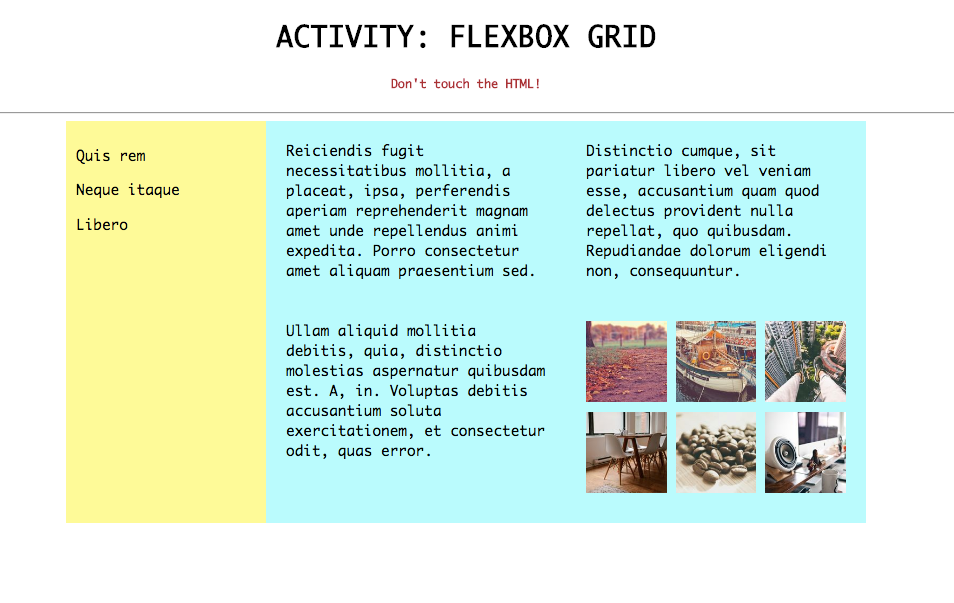

# Basic Flexbox Nested Layout

### The Mockup



### Instructions

```sh
# (1) Navigate to warmups directory
cd ~/muktek/warmups

# (2) Clone the repository
git clone https://github.com/muktek/activity--basic-flexbox-nested-layout.git

# (3) Cd into the directory and start working in the `style.css`
cd activity--basic-flexbox-nested-layout
atom .

```

Hints + Notes: 
- the HTML is already created so you do not need to alter the `index.html` file.  

- The `<div class="mini-items-container">` has a width of 100%

- `<div class="big-items">` have widths of 20% 

- Some properties you may consider: `display: flex`,  `flex-wrap`, `justify-content`, `flex-basis`.

If you cannot recall what the flexbox properties do, You may want to use this [flexbox cheatsheet](https://css-tricks.com/snippets/css/a-guide-to-flexbox/) as a resource.


### Designer Specs

```
blue  : #bff
yellow : #ff9
```
